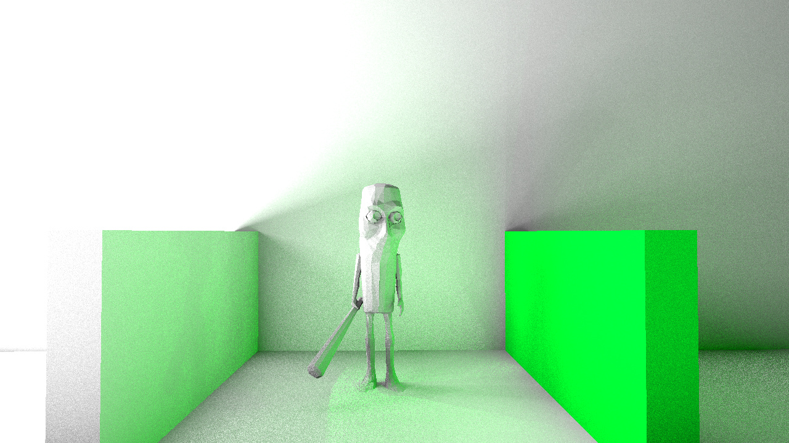

# Realistic Rendering: Photon Mapping with ReSTIR DI



This repository contains the code and data for a bachelor's thesis on combining photon mapping with ReSTIR Direct Illumination (DI). The renderer is written in C++ and supports global illumination techniques for realistic image synthesis.

## Features

- **Photon Mapping** for global illumination
- **ReSTIR DI**: Reservoir-based spatiotemporal importance resampling for efficient direct lighting, with both spatial and temporal reuse
- **Three sampling techniques**: Uniform, RIS (Reservoir Importance Sampling), and ReSTIR
- **Path Tracing**: Classic unbiased reference implementation
- **Debug Mode**: Visualizes photon-mapped virtual point lights (VPLs) using a kd-tree (nanoflann)
- **TinyBVH**: Fast BVH acceleration for ray-scene intersection
- **Interactive and rendering modes**
- All main parameters (e.g., sample counts, reuse settings) can be tuned in `constants.hpp`

### Sampling Techniques and Path Tracing

The renderer supports three direct illumination sampling techniques: **Uniform**, **RIS**, and **ReSTIR**. Uniform sampling selects lights randomly, RIS uses importance sampling with reservoirs, and ReSTIR extends this with both spatial and temporal reuse for improved efficiency and quality. In addition to these, a classic path tracing mode is available for unbiased reference rendering. The debug mode allows visualization of the photon-mapped VPLs and their spatial structure using a kd-tree built with nanoflann.

## Technologies

- C++20
- OpenMP (multithreading)
- SDL2 (windowing & input)
- GLM (math)
- [TinyBVH](https://github.com/madmann91/tinybvh) (BVH acceleration)
- [nanoflann](https://github.com/jlblancoc/nanoflann) (kd-tree for VPLs)
- stb_image, stb_image_write, tinyobjloader (assets)
- Python (evaluation scripts)

## Dependencies

- C++20 compiler (MSVC, GCC, or Clang)
- CMake 3.28+
- SDL2
- Python 3 (for evaluation)

## Build & Run

```pwsh
# Clone and build
cmake -S . -B build
cmake --build build --config Release

# Run the renderer from the build directory
./build/restir-vpl.exe
```

## Usage

- Place scenes/models in `objects/`
- Output images are saved in `images/`
- Use the debug mode to visualize photon-mapped VPLs and kd-tree structure
- Sampling technique and mode can be selected at runtime
- Tune parameters in `constants.hpp`

## Live View Controls

The interactive live view supports real-time camera movement, sampling mode switching, and scene manipulation. Controls:

- **W/A/S/D**: Move camera forward/left/back/right
- **Space / Left Ctrl**: Move camera up/down
- **Mouse**: Look around (yaw/pitch)
- **Shift**: Sprint (move faster)
- **1/2/3**: Switch sampling mode (1: Uniform, 2: RIS, 3: ReSTIR)
- **4**: Enable path tracing mode
- **V/B/N**: Switch shading mode (V: Shading, B: Debug, N: Normals)
- **Up/Down Arrow**: Increase/decrease number of light samples (M)
- **L**: Spawn a point light at the camera position
- **Backspace**: Remove the most recently spawned point light
- **G**: Toggle global illumination (GI) on/off
- **O/I**: Save/load camera position to/from file
- **Enter**: Output a render with the current camera
- **Esc**: Exit live view

## References

- [ReSTIR: Spatiotemporal Reservoir Resampling for Real-Time Ray Tracing](https://research.nvidia.com/publication/2020-07_restir)
- [Photon Mapping](https://graphics.stanford.edu/courses/cs348b-00/papers/veach-chapter8.pdf)
- [TinyBVH](https://github.com/madmann91/tinybvh)
- [nanoflann](https://github.com/jlblancoc/nanoflann)
